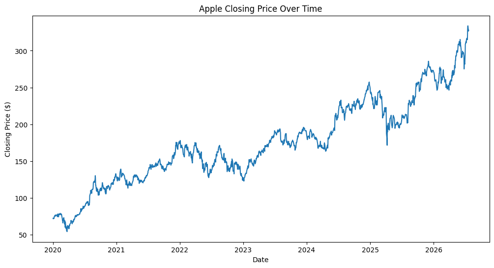
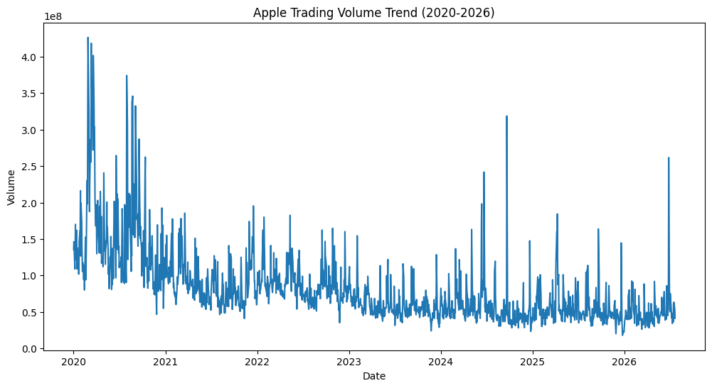
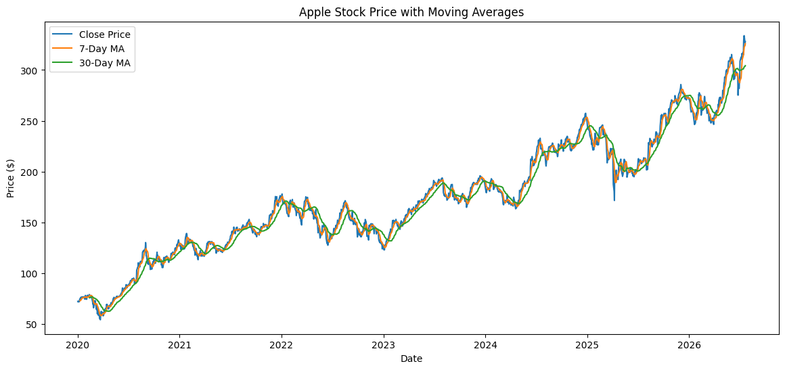
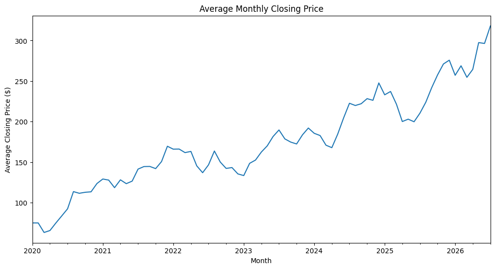
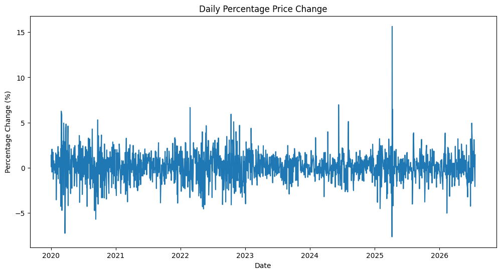

# Apple (AAPL) Stock Price Analysis 2020 to 2026

Exploratory data analysis of Apple Inc. (AAPL) stock performance from January 2020 through July 2026, covering price trends, trading volume, moving averages, monthly returns, and daily volatility.

Every dataset has a story to tell. This project uses Python to uncover the story hidden in six years of Apple's stock data and turn it into insights investors can act on.

## Project Overview

This notebook pulls historical AAPL stock data directly from Yahoo Finance, cleans and transforms it, engineers time-based features, and answers five core business questions through visualization and written insight. Each analysis section follows a **Business Question → Insight → Recommendation** structure, mirroring how a data analyst would communicate findings to a non-technical stakeholder.

## Business Questions Answered

1. **Price Trend** — How has Apple's closing stock price changed over time, and what does the trend tell investors?
2. **Trading Volume** — How has Apple's trading volume changed from 2020 to 2026, and what does it reveal about investor activity?
3. **Moving Averages** — How do short-term (7-day) and long-term (30-day) moving averages help identify Apple's price trend?
4. **Monthly Returns** — How has Apple's average monthly closing price changed over the six-year period?
5. **Daily Volatility** — How stable is Apple's stock from day to day?

## Key Insights

- Apple's closing price grew from roughly **$72** in early 2020 to over **$310** by mid-2026, showing a strong long-term upward trend despite short-term dips (notably 2022 and early 2025).
- Trading volume was highest in 2020–2021 (spikes above 400M shares/day) and gradually declined from 2022 onward, with occasional spikes tied to major news or earnings events.
- The 7-day moving average tracks short-term price movement closely, while the 30-day average smooths out noise to reveal the underlying long-term trend.
- Most daily price changes stay within **±3%**, with rare spikes (up to +13% / -8%) that typically signal major market events.
- Monthly averaging confirms the long-term growth trend is far steadier than day-to-day price action suggests.

**Overall takeaway:** Apple has shown consistent long-term growth from 2020–2026. Short-term volatility and volume spikes are best used as signals to investigate news events, not as standalone trading triggers.

## Visuals

**Closing Price Trend**


Closing Price Trend: Plotted AAPL's full closing-price series (2020–2026) to separate genuine trend from daily noise. The stock grew from ~$72 to over $310, with pullbacks in 2022 and early 2025 that recovered rather than reversed — the kind of read that separates a buying dip from a real downturn.

**Trading Volume Trend**


**Moving Average Analysis (7-Day vs 30-Day)**


**Monthly Returns Trend**


**Daily Percentage Change**



## Tools & Libraries

- **Python**
- `yfinance` — pulling historical stock data
- `pandas` — data cleaning, transformation, and feature engineering
- `matplotlib` — data visualization

## Methodology

1. **Data Collection** — Downloaded daily AAPL OHLCV data (2020-01-01 to 2026-07-22) via the `yfinance` API and saved to CSV.
2. **Data Cleaning** — Checked for duplicates, missing values, correct data types, and consistent date formatting.
3. **Feature Engineering** — Created daily price change, daily percentage change, year/month/day fields, 7-day and 30-day moving averages, monthly returns, and a volatility measure.
4. **Exploratory Data Analysis & Visualization** — Plotted closing price trend, trading volume trend, moving average comparison, monthly returns, and daily percentage change distribution.
5. **Business Interpretation** — Translated each chart into a plain-language insight and actionable recommendation.

## Repository Structure

```
├── aapl.ipynb                      # Full analysis notebook
├── Apple_Stock_Data.csv            # Raw data pulled from Yahoo Finance
├── closing_price_trend.png         # Chart: closing price trend
├── trading_volume_trend.png        # Chart: trading volume trend
├── moving_average_analysis.png     # Chart: 7-day vs 30-day moving average
├── monthly_returns_trend.png       # Chart: monthly average closing price
├── daily_percentage_change.png     # Chart: daily % change volatility
└── README.md                        # Project overview (this file)
```

## Data Source

Historical AAPL data sourced from [Yahoo Finance](https://finance.yahoo.com) via the `yfinance` Python library.

## Author

**Benjamin Umanta Esther**
Data Analyst | Economics Student
📊 SQL · Excel · Python · Power BI

